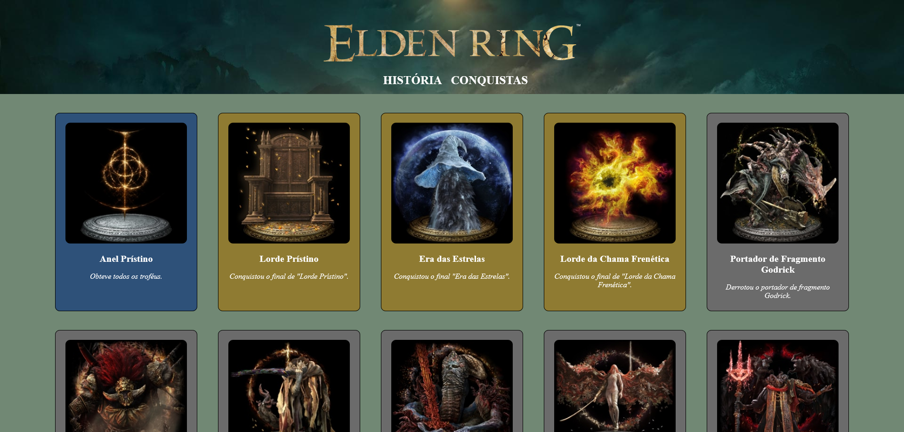

# Elden Ring - Trophy Guide

Um guia de troféus do jogo Elden Ring, desenvolvido com o intuito de praticar HTML e CSS.

## Screenshot

## Stack utilizada

- HTML5 
- CSS3
- Mobile-first

## Aprendizados

•   Estruturar uma página responsiva partindo do zero

•	Versionar o código e subir para repositório no Git Hub

•	Hospedar a página com o GitHub Pages

## Demonstração

https://danilo-tx.github.io/HTML-CSS-EldenRing-TrophyGuide/